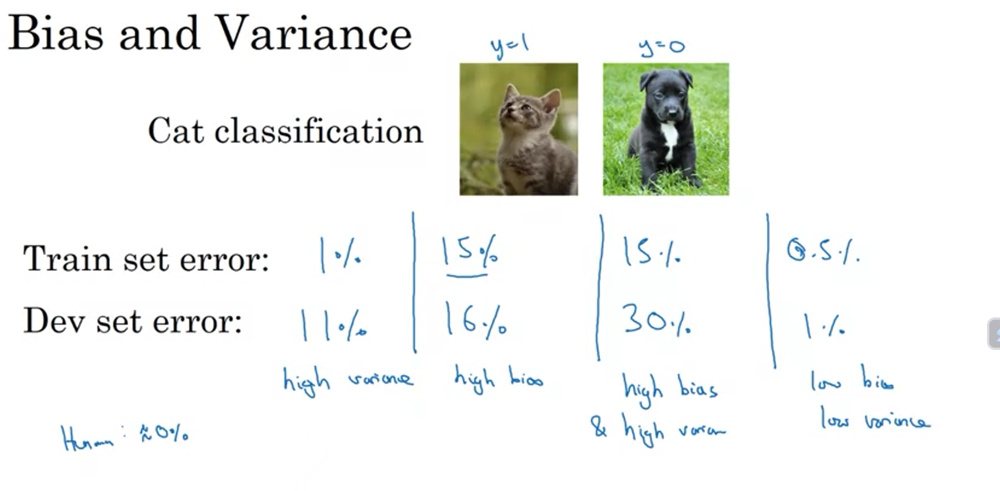
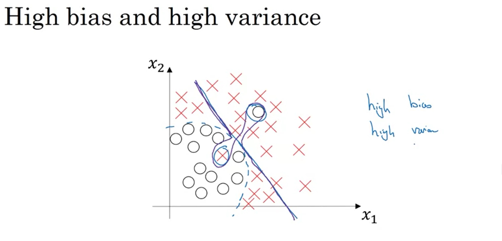

#General Discription 
    Better you are at ML, more sophisticated will be ur undersranding about bias and variance.
    easy learning but tricky mastering

-------------------------------

(1) The pic above depicts the 3 cases in which diffrent classifiers perform of the same set of data.

UNDERFITTING
(2) In the first pic the model is said to be underfitting the data cuz it is performing poorly on the 
    traning set and dev set of a model itself which is not good for a model.

    *An underfit model is too simple to capture the intricacies of your data. It’s like trying to      summarize “War and Peace” with a single emoji. 

OVERFITTING
(3) In the 3rd pic the model is doing extremely well on the traning set almost giving less then 
    1% error but performing poorly on dev test then this condition is colled overfitting.

    *: An overfit model has memorized the training data so well that it’s like a parrot reciting Shakespeare—impressive, but not adaptable.

BOTH
There might be a case in which a model has both high bias and varaince which is the sometimes underfitting and sometimes overfitting.

-------------------------------------
WE GET THIS TYPE OF CLASSIFIERS FOR HIGHER DIMENSIONS.

(4) 2nd model is most balanced it performs decently on both traning and dev test less error less than 
    1% for traning and 2% for dev(its an example).

-----------------   ------------------

(5) **All the models with error greater then 10% are said to be bad or non-efficient under the assumption that human level error or "bayers error or optimum error" is close to 0%. If the bayers error is let us assume 15% then the model with bias and variance close to that will be considered good despite having errors more than 0% **(EXAMPLE----HUMAN ERROR IS HIGH FOR BLURRY IMAGES)

(6) All in all performance on traning data tells us about the bias of the model and performance on dev test can tell how bad is the variance of the problem.

ALL THIS IS TRUE WHEN BAYERS ERROR IS QUITE LOW AND TRANING DATA AND DEV DATA ARE DROWN FROM THE SAME DISTRIBUTION.IF THESE ASSUMPTIONS ARE VIOLATED THEN ANALYSIS WILL BE MORE SOPHISTICATED.