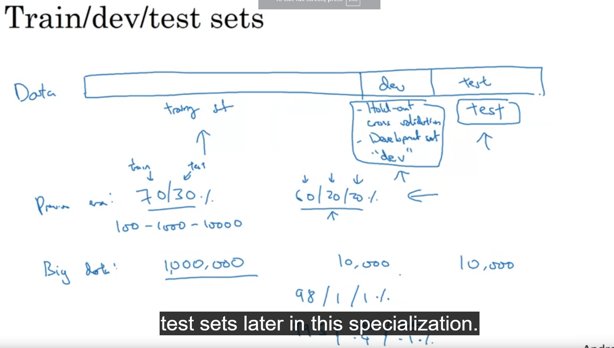

# Intro : In this particular course I will learn practical aspects like how to make a neural network work well. It will range from hyperparameter tuning,how to set data, how to make sure optimization algo works faster. Ai/ml is an highlt iterative process.

#Hyperparameters :-
    Learning rate
    Iterations
    Hidden layers L
    Hidden units n
    choice of activation function
    parameters like - w[1],b[1],w[2],b[2]
    These parameters are known as hyperparameters becouse they control the parameters.
    hyperparameters are mostly decided by an emperical process of:(exact values are not known)
    # Experiment <-> idea <-> Code

In this patricular section we will learn about hyperparameter tuning,optimization and regularization. 

(1) To train an efficient model and go around the empherical process effectively it is important to    set up data well. 

(2) Traning data set is divided into--

    traning set| dev(hold out,cross validation,development test) set |test set .
    *We can train diffrent models using traning data set and check which works best on dev test and use it for the test set for usnbiased result.

    Depending upon the amount of data we can split the data between these three catagoties
    Example:: if(total data==100) if data is in millions then deva dn test will be less then 1%.
            traning==60
            dev==20
            test==20
    For traning, data can come from diffrent sources becouse of large data requirement for traning a large neural network. But for faster progress in ml algorithm make sure that that dev/test comes from the same source.

(3) It is necessary for the dev nd test data set to come from same distribution 
    Reason:
    statistical consistency.
    Avoid Overfitting
    Generalization:
    Guidelines for Choosing Dev and Test Sets:
    *Future Data: Choose a dev and test set that reflects the data you expect to encounter in the 
    future. This ensures that your model’s performance estimates are relevant.
    
    *Sample Size: The dev and test sets should be large enough to provide representative performance metrics. For larger datasets, around 10,000 examples each (about 1% of the total data) can suffice.
    
    *Train-Dev Set: If the training set and dev sets have different distributions, introduce a train-dev set with the same distribution as the training data. Use this set to measure overfitting.

(4) Best Practices:
    *Consistent Split: Maintain the same split (train/dev/test) across experiments for fair evaluation of different models.
    *Reproducibility: Create a reproducible script to generate the train/dev/test split consistently.
    *Same Distribution: Ensure that the dev and test sets represent the same distribution as the training data.

(5) In exteme cases it is ok to not have test set cuz its work is only to give us 
    an unbiased estimation.

