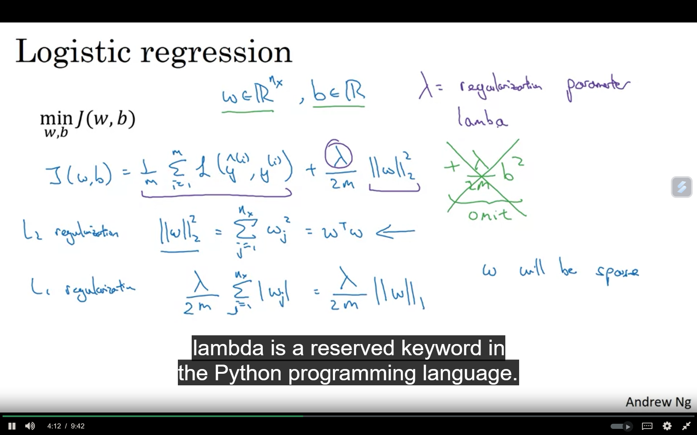
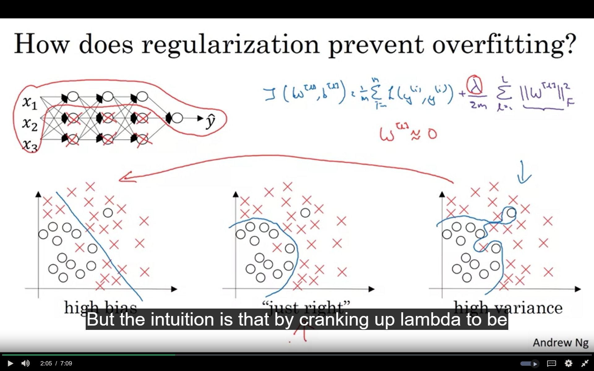

 # If the model is overfitting the data i.e variance is very high then we can regulization as one of the methods.
    Some Types:-
    # L1
    # L2
    # Dropout Regulization

    Logistic Regression and Neural Network    

    L1 paramenters makes our parameters W sparse which is helpful in model compressing cuz ir consomes less memory.
    L2 regulization is also known as weight decay

    we basically ass a new expression in the xost function. 

    Why Regulization???

    Adds Penalty to Model Complexity: Regularization adds a term to the loss function that penalizes large coefficients in the model.

    Dropout Regulization??
    We randomly select some neurons from diffrent layers using different probablity factor for different layers and delete those neurons it will decrease the overfitting by traning the model with less numbera of neurons but it will make the cost function ineffective for gradient decend.

    OTherMethods::

    Flipping of images and making some changes to data to inc the amount of data
    
    