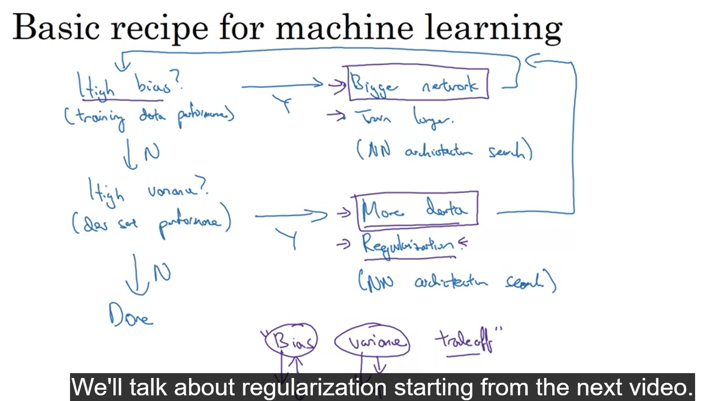

## High bias second point--train longer(not work always)

## Bias-variance trade off of older times
    Earlier there was a trade of cuz of lack of data.
    Bigger Neural Network always reduce bias without affecting the variance.
    As long as it is a well regulaised network
## Regularization
for lowering the variance
trade off for bias in smaller networks

